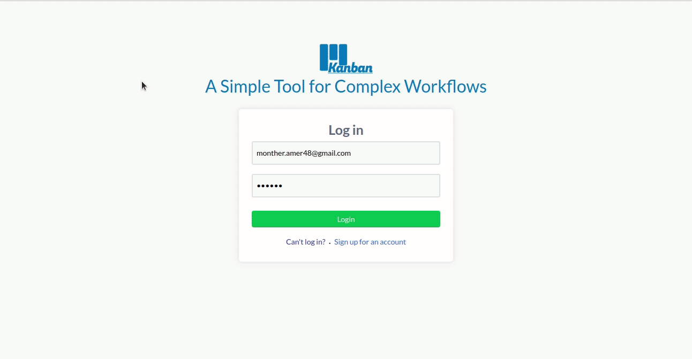

# Kanban

Kanban is a simple trello app build using ExpressJS an ReactJS.

### [Demo](https://simple-trello123.herokuapp.com/)

### Installation

- clone the repo
- install packages for express -`npm install`
- install packages for react -`cd public` -`npm install`
- run the dev mode -`npm run start:dev`

### Features!

since it is a simple trello it contains some of main trello features

- create boards, lists and cards
- Drag and drop cards and lists
- add members to your board

### Tech

Kanban uses a number of open source projects to work properly:

- [Express](https://expressjs.com/) - Web framework for Node.js
- [React](https://reactjs.org/) - JavaScript library for building user interfaces
- [react-redux](https://react-redux.js.org/) - state managment
- [react-beautiful-dnd](https://www.npmjs.com/package/react-beautiful-dnd) - react drag and drop library

### Todos

- add functionality to invite people to kanban
- add notification system
- allow user to create teams
